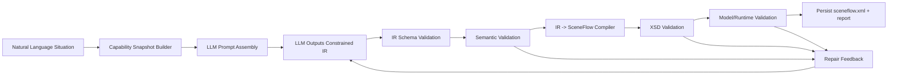

# LLM-Supported SceneFlow Generation

## Motivation

Generating `sceneflow.xml` directly from natural language is attractive, but brittle.
Our discussion identified the key issue:

- `XSD` can enforce XML structure, but not behavior-level correctness.
- SceneFlow authoring depends on project context (variables, plugins, commands, existing nodes/edges).
- LLMs are better at intent mapping than strict graph/XML bookkeeping.

The pragmatic strategy is therefore:

1. Use `XSD` as the first structural guardrail.
2. Provide semantic capability context from the running/project state.
3. Ask the LLM to produce a constrained intermediate representation (IR), not raw XML.
4. Compile IR to canonical `sceneflow.xml`.
5. Validate and repair in a deterministic loop.

This combines flexibility (NL prompts) with reliability (typed contracts + validators).

## Goals

- Generate valid SceneFlow changes from high-level situations (for example: "wait until user presses Okay button").
- Ensure generated results are structurally valid and semantically executable.
- Reuse existing project context (variables like `UIEvent`, plugin commands, existing graph).
- Support repeated generation of multiple instances without format drift.

## Non-Goals

- Fully replacing manual scene authoring immediately.
- Allowing unconstrained free-form XML generation.
- Encoding all runtime semantics in XSD alone.

## Syntax Strategy: Shorter Than XSD

To guide an LLM, a shorter representation than raw XML/XSD is preferred.

### Option A: JSON IR + JSON Schema (Recommended Primary)

- Compact and model-friendly for generation.
- Strong ecosystem support for validation/tooling.
- Easy to serialize in prompts and in repair loops.
- Clear upgrade path via schema versioning.

Use this as the primary LLM output contract.

### Option B: Logical Representation (Recommended for Semantic Rules)

Example style: facts + rules over nodes/edges/variables.

- Strong for expressing graph invariants and cross-reference constraints.
- Good fit for semantic validation and repair diagnostics.
- Usually less ergonomic as the main authoring format for most teams.

Use this as an internal validator layer, not necessarily as primary generation format.

### Option C: Custom DSL (Optional Later)

- Can be very concise and human-friendly.
- Requires extra parser/compiler maintenance and ambiguity control.
- Higher implementation cost than JSON IR.

Use only if JSON IR proves too verbose for authors.

### Final Position

- Keep `XSD` as XML guardrail for final output.
- Use **JSON IR + JSON Schema** for LLM generation.
- Add **logical semantic rules** for correctness beyond schema shape.

## Target Architecture

## Pipeline (Detailed)

### 1. Capability Snapshot Builder

Build a snapshot from core runtime and current project state. This snapshot is passed to the LLM and validators.

Suggested contents:

- Project metadata:
  - active supernode
  - existing nodes/edges IDs
  - available scene names
- Variable context:
  - name, type, scope
  - read/write hints where available
- Plugin/runtime capabilities:
  - plugin IDs/class names
  - supported action commands and params
  - constraints (Android-compatible only, optional)
- Edge/node constraints:
  - allowed edge types (`EEDGE`, `TEDGE`, `IEDGE`, ...)
  - timeout bounds/defaults
  - condition language constraints

Output format: versioned JSON (`capabilitySnapshot`).

### 2. Prompt Assembly

Prompt = situation + capability snapshot + IR schema + few-shot examples.

Prompt rules:

- "Output JSON IR only"
- "Use existing variable names; do not invent if disallowed"
- "Reference existing IDs only when patching"
- "Declare unresolved assumptions explicitly"

### 3. LLM Generates Constrained IR

LLM output is a typed IR document, for example:

- `create_supernode`
- `create_node`
- `create_edge`
- `set_condition`
- `set_timeout`
- `link_supernode_to_node`

No raw XML in this step.

### 4. IR Schema Validation

Validate against JSON Schema (or equivalent):

- required fields
- enums
- types
- cardinalities
- ID/reference shape

Fail fast with machine-readable errors.

### 5. Semantic Validation

Validate IR against runtime/project semantics:

- referenced variables exist (`UIEvent` check)
- node/edge references exist or are created in correct order
- edge-type-specific rules (`TEDGE` must have timeout, `IEDGE` condition format, etc.)
- graph sanity (no illegal dangling refs, required start-node constraints)
- optional policy checks (forbidden APIs/plugins, naming conventions)

### 6. Compile IR -> SceneFlow XML

Compiler applies IR operations to the in-memory model and emits canonical XML:

- stable element ordering
- deterministic IDs (or controlled UUID policy)
- normalized whitespace/formatting
- optional diff/patch mode (apply only changed parts)

### 7. XML Validation Layer

Run:

- `XSD` validation (structure)
- model validation (existing Java/runtime checks)

If validation fails, map failures to repair hints.

### 8. Repair Loop

Return compact structured errors to the LLM:

- error code
- location
- expected vs actual
- allowed alternatives

Retry IR generation with bounded attempts, then surface actionable failure report.

### 9. Persist + Report

On success:

- write updated `sceneflow.xml`
- produce summary:
  - what was added/changed
  - assumptions used
  - unresolved risks

## Example Mapping (Situation -> IR Intent)

Situation:

- "Wait until the user pressed the Okay button."

Expected semantic pattern:

- supernode contains a node with a `TEDGE` self-loop (`1000ms`) to poll/wait
- supernode exits via `IEDGE` conditioned by `UIEvent == \"OkayButton\"`
- `UIEvent` must already exist in project variable definitions

This pattern should be encoded as a reusable template so the LLM selects and parameterizes it instead of inventing structure each time.

## Meta-Level Pattern Model (Implemented)

The template library now uses a meta-level abstraction:

- `constraint`: what must become true (for example `event == "OkayButtonPressed"`).
- `constrained activity`: what runs while the constraint is false.
- `policy`: cadence/liveness strategy for the constrained activity.
- `completion`: exit transition once the constraint is satisfied.

In implementation terms:

- Meta spec type: `ConstrainedActivitySpec`
- Concrete pattern source: `template-constrained-activity`
- Prompt resolver: maps situation text to meta fields (`activity kind`, `interruptibility`)
- Pattern selector: data-driven match against `/Users/gebhard/Code/Repo/VisualSceneMaker/doc/interactive-design-pattern-catalog.json` (`patternLibrary[*].supportsMeta`), with base fallback only if no implemented match exists
- Default constrained activity: minimal liveness loop (`TEDGE` self-loop)
- Optional constrained activity: reminder loop (wait -> reminder -> wait via `TEDGE`)

This keeps natural-language generation on an abstract level while compiling deterministically into valid SceneFlow operations.

Catalog artifact:

- `/Users/gebhard/Code/Repo/VisualSceneMaker/doc/interactive-design-pattern-catalog.json`
- Contains both layers (`metaModel`, `patternLibrary`) and scientific references for each pattern entry.

## Realization Matrix: Meta/Pattern -> SceneFlow

Human-readable summary:

- `constraint` maps to `IEDGE`/`CEDGE` with normalized condition expressions; for reactive waiting, exit source should be the supernode.
- `constrainedActivity` maps to internal active subflow inside supernode:
  - minimal liveness: one waiting node with self `TEDGE`
  - reminder: waiting/reminder timed cycle
  - richer activities: additional internal nodes/edges (multimodal/social behavior)
- `policy` maps to edge timing and guard/control logic:
  - `intervalMs` -> `TEDGE.timeout`
  - `maxRepeats` -> counter variable + command updates + guard edge
  - `interruptibility` -> guarding `CEDGE` before activity transitions
- `completion` maps to explicit continuation transition with valid target node id outside constrained supernode scope.

Machine-readable mapping artifact:

- `/Users/gebhard/Code/Repo/VisualSceneMaker/doc/meta-to-sceneflow-mapping.json`
- Intended for validator/compiler alignment and future auto-check generation.

## Implementation Plan

### Phase 0: Groundwork

1. Inventory current XML model mappings (JAXB/XStream/getters/setters).
2. Generate baseline `XSD` from model + manual fixes where needed.
3. Add CI check: all committed `sceneflow.xml` files validate against XSD.

Deliverables:

- initial `sceneflow.xsd`
- validator task in Gradle

### Phase 1: Constrained IR Definition

1. Define IR schema `v1` (JSON Schema).
2. Include operation set for core authoring actions.
3. Add compatibility policy (version field + migration strategy).
4. Document mapping from IR fields to XML model setters/getters.

Deliverables:

- `sceneflow-ir.schema.json`
- schema validation utility

### Phase 2: Capability Snapshot Service

1. Implement snapshot builder from runtime/project state.
2. Expose snapshot as JSON for prompting and validator reuse.
3. Add contract tests for snapshot completeness.
4. Provide a CLI/Gradle entrypoint for fixture generation from real projects.

Deliverables:

- `CapabilitySnapshot` model + serializer
- test fixtures from sample projects
- schema: `doc/capability-snapshot.schema.json`
- first fixture: `doc/capability-snapshot.designpatterns.json`
- generation task: `./gradlew generateCapabilitySnapshot -PsnapshotProjectDir=... -PsnapshotOut=...`

### Phase 3: Semantic Validator

1. Implement rule engine over IR + snapshot.
2. Introduce structured error catalog (`code`, `message`, `path`, `hint`).
3. Add scenario tests (including `UIEvent`/button-wait pattern).
4. Express critical graph rules in logical-style predicates (implementation language can remain Java).

Deliverables:

- semantic validator module
- rule test suite

### Phase 4: IR Compiler

1. Implement IR -> model mutation layer.
2. Emit canonical XML output.
3. Add round-trip tests (IR -> XML -> model).

Deliverables:

- compiler module
- canonicalization tests

### Phase 5: Orchestration + Repair Loop

1. Build generation orchestrator (prompt -> IR -> validate -> compile).
2. Add bounded retry strategy with structured feedback.
3. Add trace logging for audit/debugging.

Deliverables:

- `generateFlowFromSituation(...)` service
- retry/telemetry support

### Phase 6: Templates and Quality Improvements

1. Add high-value templates:
   - constrained-activity (meta-level pattern family)
   - timeout-retry
   - command-on-condition
2. Add few-shot examples tied to templates.
3. Measure quality metrics and tune prompt/validators.

Deliverables:

- template library
- benchmark set + quality report

## Acceptance Criteria

- A natural-language situation can generate a valid flow update with:
  - passing IR schema validation
  - passing semantic validation
  - passing XSD/model validation
- Deterministic output for identical inputs (except controlled IDs if configured).
- Repair loop produces actionable error messages and avoids silent corruption.

## Risks and Mitigations

- Over-constrained IR limits expressiveness.
  - Mitigation: versioned schema with extension points.
- Under-specified semantic rules allow invalid behavior.
  - Mitigation: expand rule catalog from real failure cases.
- Prompt drift across model versions.
  - Mitigation: strict "IR-only" contract + parser/validator gate.
- Context size growth.
  - Mitigation: summarize snapshot by scope and only include relevant capabilities.

## Recommended Next Step

Start with `Phase 0` + `Phase 1` in one iteration:

- baseline XSD + validator task
- IR schema v1 + validator

Then add semantic validator rules (including logical-style graph checks) for 2-3 concrete patterns (including the `UIEvent == "OkayButton"` wait-flow) before integrating LLM orchestration.
