# SceneMaker Dependency Map

This document describes the Gradle module dependencies after introducing the `editor` subproject.

```mermaid
graph TD
    Root["root (SceneMaker3)"] --> Core[:core]
    Root --> Editor[:editor]
    Root --> PlugAlma[:plugins:alma]
    Root --> PlugAndroid[:plugins:AndroidGui]
    Root --> PlugConsole[:plugins:console]
    Root --> PlugEmail[:plugins:email]
    Root --> PlugStudy[:plugins:studymaster-web]
    Root --> PlugFortune[:plugins:fortunecookie]
    Root --> PlugEmma[:plugins:emma-user-model]
    Root --> PlugDecad[:plugins:decad]
    Root --> PlugHtmlGui[:plugins:htmlgui-ws]
    Root --> PlugOdp[:plugins:odp]
    Root --> PlugQr[:plugins:qrwebcam]
    Root --> PlugUnity[:plugins:unity]
    Root --> PlugWizard[:plugins:wizard]
    Root --> PlugYallah[:plugins:yallah]
    Root --> PlugSsi[:plugins:ssi]
    Root --> PlugSsj[:plugins:ssj]
    Root --> PlugReeti[:plugins:reeti]
    Root --> PlugTimer[:plugins:timer]
    Root --> PlugTriCat[:plugins:tricatworld]
    Root --> PlugCharamel[:plugins:charamel]
    Root --> PlugCharamelWs[:plugins:charamel-ws]
    Root --> PlugSockets[:plugins:sockets]
    Root --> PlugDrive[:plugins:DriveSimulator]
    Root --> PlugVlc[:plugins:VLCRemoteController]

    Editor --> Core
    PlugAlma --> Core
    PlugAndroid --> Core
    PlugConsole --> Core
    PlugEmail --> Core
    PlugStudy --> Core
    PlugFortune --> Core
    PlugEmma --> Core
    PlugDecad --> Core
    PlugHtmlGui --> Core
    PlugOdp --> Core
    PlugQr --> Core
    PlugUnity --> Core
    PlugWizard --> Core
    PlugYallah --> Core
    PlugSsi --> Core
    PlugSsj --> Core
    PlugReeti --> Core
    PlugTimer --> Core
    PlugTriCat --> Core
    PlugCharamel --> Core
    PlugCharamelWs --> Core
    PlugSockets --> Core
    PlugDrive --> Core
    PlugDrive --> PlugSockets
    PlugVlc --> Core

    Core --> Cup["java-cup-runtime (compileOnly/runtimeOnly)"]
    Core --> Jpl["jpl"]
    Core --> Jaxb["jaxb-api"]
    Core --> Anno["annotations"]
```

Notes:
- `root` assembles the runnable jar and depends on `:editor`, `:core`, and all plugins.
- `:editor` contains the Swing UI, web server, and web UI build (`editor/web-ui`).
- `:core` remains independent of editor code and provides runtime + model.
- Plugins depend on `:core`; shared project property types now live in `core` under `de.dfki.vsm.model.project.property`.
