# SceneMaker Dependency Map (Web-v1.0)

This document reflects the current Gradle multi-project dependency layout.

```mermaid
graph TD
    Root["root app (SceneMaker4)"] --> Core[:core]
    Root --> CoreWeb[:core-webserver]
    Root --> CoreHttpJdk[:core-http-jdk]
    Root --> CoreLogicJpl[:core-logic-jpl]
    Root --> Editor[:editor]
    Root --> PAlma[:plugins:alma]
    Root --> PAndroid[:plugins:AndroidGui]
    Root --> PEmail[:plugins:email]
    Root --> PStudy[:plugins:studymaster-web]
    Root --> PFortune[:plugins:fortunecookie]
    Root --> PUserCue[:plugins:user-cue-service]
    Root --> PDecad[:plugins:decad]
    Root --> PHtml[:plugins:htmlgui-ws]
    Root --> POdp[:plugins:odp]
    Root --> PQr[:plugins:qrwebcam]
    Root --> PUnity[:plugins:unity]
    Root --> PWizard[:plugins:wizard]
    Root --> PYallah[:plugins:yallah]
    Root --> PSsi[:plugins:ssi]
    Root --> PSsj[:plugins:ssj]
    Root --> PReeti[:plugins:reeti]
    Root --> PTimer[:plugins:timer]
    Root --> PTri[:plugins:tricatworld]
    Root --> PChar[:plugins:charamel]
    Root --> PCharWs[:plugins:charamel-ws]
    Root --> PSockets[:plugins:sockets]
    Root --> PDrive[:plugins:DriveSimulator]
    Root --> PVoice[:plugins:voicetts]

    CoreWeb --> Core
    CoreWeb --> CoreHttpJdk
    CoreHttpJdk --> Core
    CoreHttpAndroid[:core-http-android] --> Core
    CoreLogicJpl --> Core

    Editor --> Core
    Editor --> CoreLogicJpl

    RuntimeServer[:runtime-server] --> Core
    RuntimeServer --> CoreWeb
    RuntimeServer --> CoreLogicJpl
    RuntimeServer --> PTimer

    PAlma --> Core
    PAndroid --> Core
    PAndroid --> CoreHttpAndroid
    PEmail --> Core
    PStudy --> Core
    PFortune --> Core
    PUserCue --> Core
    PDecad --> Core
    PHtml --> Core
    POdp --> Core
    PQr --> Core
    PUnity --> Core
    PWizard --> Core
    PWizard --> CoreLogicJpl
    PYallah --> Core
    PSsi --> Core
    PSsj --> Core
    PReeti --> Core
    PReeti --> CoreLogicJpl
    PReeti --> PSsi
    PTimer --> Core
    PTri --> Core
    PTri --> CoreLogicJpl
    PTri --> PSsi
    PChar --> Core
    PChar --> CoreLogicJpl
    PChar --> PSsi
    PChar --> PTri
    PCharWs --> Core
    PSockets --> Core
    PDrive --> Core
    PDrive --> PSockets
    PVoice --> Core

    Services[:services aggregator] --> SEmb[:services:embeddings]
    Services --> SSem[:services:semantic-analysis]
    Services --> SUd[:services:semantic-ud]

    Core --> Cup["java-cup-runtime (compileOnly/runtimeOnly)"]
    CoreLogicJpl --> Jpl["jpl"]
    Core --> Json["org.json"]
```

## Notes

- The root app is web-first (`SceneMaker4`) and assembles `:core`, server/transport modules, `:editor`, and the plugin set.
- `:core-webserver` hosts `WebUiServer` and depends on `:core` + `:core-http-jdk`.
- `:runtime-server` is the standalone runtime entry (`RuntimeMain`) and depends on `:core`, `:core-webserver`, `:core-logic-jpl`, and `:plugins:timer`.
- `:core-http-android` is the Android HTTP/WS transport module (used directly by `:plugins:AndroidGui` and Android integration flows).
- `:editor` is no longer the Swing launcher; it provides web UI build assets and editor-side services.
- Services are independent subprojects under `:services:*` and are not packaged into the main root app jar by default.
