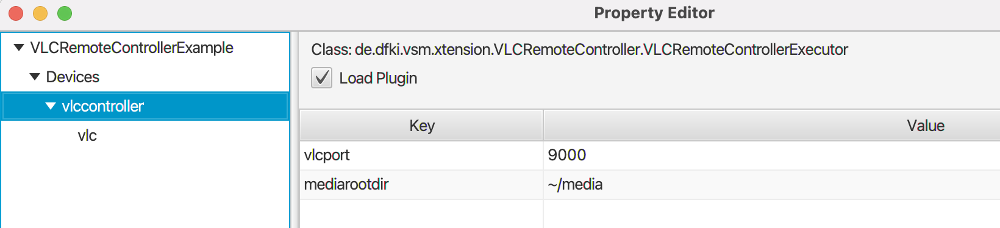

# VLC Remote Controller - VSM Extension

This VSM extension allows the playback of any media supported by the VLC player.

## How to use it

* Download the VLC media player from <https://www.videolan.org>;
* From a terminal/command-line, run VLC with the `rc` (remote console) interface.

      path/to/VLC --extraintf rc --rc-host localhost:9000

  * For more information: <https://wiki.videolan.org/Documentation:Advanced_Use_of_VLC/>;

* Create a VSM project and create a new device of type `VLCRemoteControllerExecutor`
  * Configure the properties:
    * `vlcport` - (int) The port VLC is listening to (e.g., 9000).
    * `mediarootdir` - (String, Optional) Set a root folder for searching the media files to play;
      * If NOT specified, the default media root directory is the same directory hosting the project dir.

    

* Add an agent (e.g. `vlc`)
* Control media playback with scene commands. E.g.:
  * `vlc: [play file="path/to/file.mp4"].`
    * here, the media root dir will be prepended to the file name.
  * `vlc: [play url="http://host/to/file.mp4"].`
  * `vlc: [stop].`

An example Project is included in the `ExampleProject` directory.

## Advices

* If you try to play a non existing file, or a corrupted file, VSM will give no errors. Check the VLC console for more information.
   