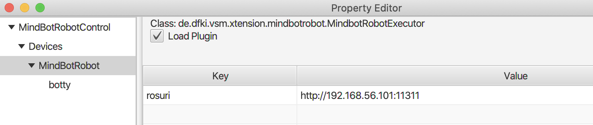
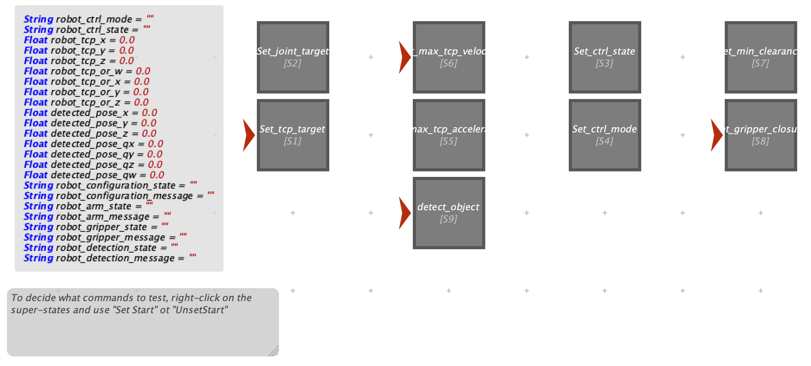

# MindBot Robot Controller

This plugin (`mindbotrobot`) is developed within project MindBot (<https://www.mindbot.eu>) and allows to pilot the Collaborative robots through Visual Scene Maker.

The plugin uses rosjava (<http://wiki.ros.org/rosjava>) to connect to a remote Linux machine running the robot within a ROS (<https://www.ros.org/>) architecture.

## Prerequisites

The plugin can be tested on a network where the MindBot robot is running. Please, refer to the MindBot code repository <https://mindbotgit.cloud.garrservices.it/wp5/mindbot-robot-control>

Refer to the official VSM documentation on how to set up a project and execute scenes: <http://scenemaker.dfki.de/tutorial.html>.


## Plugin setup

* Open a new VSM project and add a `MindBotRobotExecutor` device.
* Setup the device properties:
  * `rosuri` The URI (e.g., http://localhost:11311) on which the main ROS system and the robot are running.
* Add an agent for the device.



* Setup the project global variables that will be updated while the project runs:
  * `robot_ctrl_mode` (String): returns the mode of the robot among: `MODE0`, `MODE1`, `MODE2`, `Undefined`.
  * `robot_ctrl_state` (String): returns the state of the robot among: `ON`, `OFF`, `ERROR`, `Undefined`.
  * A set of variables for the TCP pose of the robot:
    * `robot_tcp_x`, `robot_tcp_y`, `robot_tcp_z` (Float) for the TCP position; and
    * `robot_tcp_or_w`,`robot_tcp_or_x`, `robot_tcp_or_y`, `robot_tcp_or_z` (Float) for the TCP orientation quaternion;
  * `robot_action_state` (String): it is updated during the execution of a remote action which expects an `action_done` callback.
  * `robot_action_message` (String): it is updated with the message brought by the last `action_done` callback.




## Invoking cobot commands

The MindBot cobot cannot speak, hence there is no support for text parsing.
Scene utterances must be composed solely by actions:

    <agent_name>: [<action_name> <parameter1>="<value1>" <parameter2>="<value2>"].
    
For example:

    botty: [set_tcp_target x=0.64 y=-0.15 z=0.95 or_w=0.50 or_x=-0.50 or_y=-0.50 or_z=0.50].

_The full-stop at the end is mandatory!_

The following actions can be invoked within scenes:

* `set_joint_target` (Blocking) The parameters specify a comma-separated list of joint names and their respective target position (rotation in degrees), velocity (in degrees/sec), and effort (N/m).
  * Parameters:
    * `joint_names` The comma-separated list of the join names. This has to be compatible with the name of the joints of the robot.
    * `positions` The comma-separated list of rotations of all joints, in degrees.
    * `velocities`
    * `efforts`
  * Example (names for iiwa robot): `[set_joint_target joint_names='iiwa_joint_0,iiwa_joint_1,iiwa_joint_2,iiwa_joint_3,iiwa_joint_4,iiwa_joint_5,iiwa_joint_6' positions='10,10,10,10,10,10,10' velocities='1,1,2,2,3,3,5' efforts='10,10,30,30,50,50,80']`.
    It sets all the joints at 10 degrees rotation.
* `set_tcp_target` (Blocking) Set position and rotation (orientation) of the robot end effector.
  * Parameters:
    * `x`
    * `y`
    * `z`
    * `or_w`
    * `or_x`
    * `or_y`
    * `or_z`
  * Example: `[set_tcp_target x=0.2 y=0.1 z=0.5 or_w=1 or_x=0 or_y=0 or_z=0].`
* `set_max_tcp_velocity` Set the velocity limits in cartesian coordinates.
  * Parameters:
    * `x`
    * `y`
    * `z`
  * Example: `[set_max_tcp_velocity x=0.5 y=1 z=1].`
* `set_max_tcp_acceleration` Set the acceleration limits in cartesian coordinates.
  * Parameters:
    * `x`
    * `y`
    * `z`
  * Example: `[set_max_tcp_acceleration x=0.5 y=1 z=1].`
* `set_ctrl_state` Set the control state (OFF=0, ON=1, ERROR=2).
  * Parameters:
    * `state` Either 0, 1, or 2.
  * Example: `[set_ctrl_state state=0].`
* `set_ctrl_mode` Set the control mode (MODE0=0, MODE1=1, MODE2=2).
  * Parameters:
    * `mode` Either 0, 1, or 2.
  * Example: `[set_ctrl_mode mode=0].`
* `set_min_clearance` Set the minimum accepted distance between robot and operator.
  * Parameters:
    * `min_clearance`
  * Example: `[set_min_clearance min_clearance=0.5].`
* `set_gripper_closure` (Blocking) Set the closure of the gripper, or better, tries to reach the specified closure, at a given speed, and stops before if a certain resistance force threshold limit is reached.
  * Parameters:
    * `closure` An integer between 0 and 255 setting the distance between the gripper tips. Indicative values (subject to changes among robots): 0=60mm, 255=10mm.
    * `velocity` An integer between 0 and 255 setting the movement speed of the gripper. Indicative values (subject to changes among robots): 0=20mm/sec, 255=150mm/sec.
    * `force` An integer between 0 and 255 setting the maximum force exerted by the gripper before stopping. Indicative values (subject to changes among robots): 0=no_force 255=5Kg.
  * Example: `[set_gripper_closure closure=255 velocity=150 force=2]`
* `detect_object` (Blocking) Starts the procedure for a visual detection of an object.
  * Parameters:
    * `name` The name of the object to detect. The name will be resolved and associated to some physical entity at the cobot side.
  * Example: `[detect_object name='gear1']`
  
## Command feedback

If actions are _blocking_, during their execution the VSM node will stop and be unlocked only
after the `action_done` service is called back, upon execution termination.
E.g., when the TCP reaches the requested position.

During the execution of _blocking_ actions, the project variable `robot_action_state` will be updated according to the following scheme (Java code extract):

```java
    // Possible state paths:
    // CALLED -> FAILURE
    // CALLED -> UNREACHABLE
    // CALLED -> UNSUCCESSFUL
    // CALLED -> EXECUTING -> FAILED
    // CALLED -> EXECUTING -> DONE
    public enum CallState {
        CALLED,     // The remote ROS service has been called
        UNREACHABLE,    // The remote ROS service answered FAILURE. The action will not be executed. Don't wait for it.
        UNSUCCESSFUL, // The remote ROS service was reachable but the recipient responded that the request can not be accomplished.
        EXECUTING,    // The remote ROS service answered SUCCESS. Action is in execution on the ROS side. Expect an action_done call when finished.
        FAILED,    // The remote ROS called back the action_done service to inform that the call couldn't execute properly.
        DONE        // The remote ROS called back the action_done to inform that the call was executed successfully.
    }
```

For the FAILED and DONE states, also the project variable `robot_action_message` will be set.