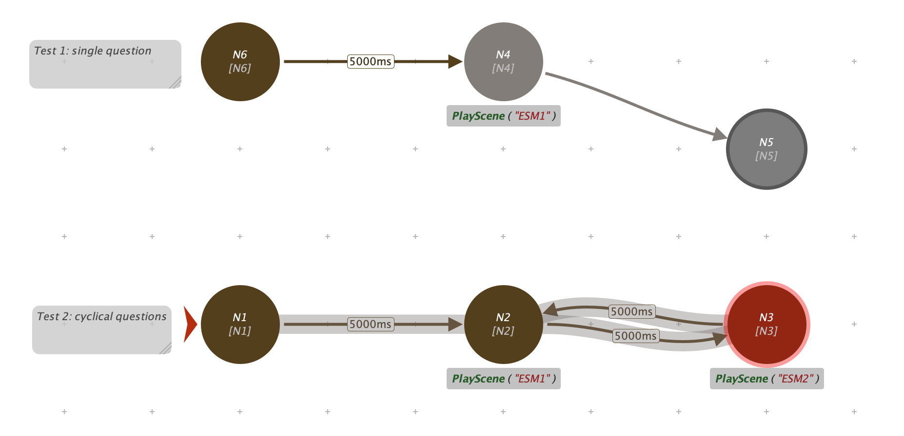
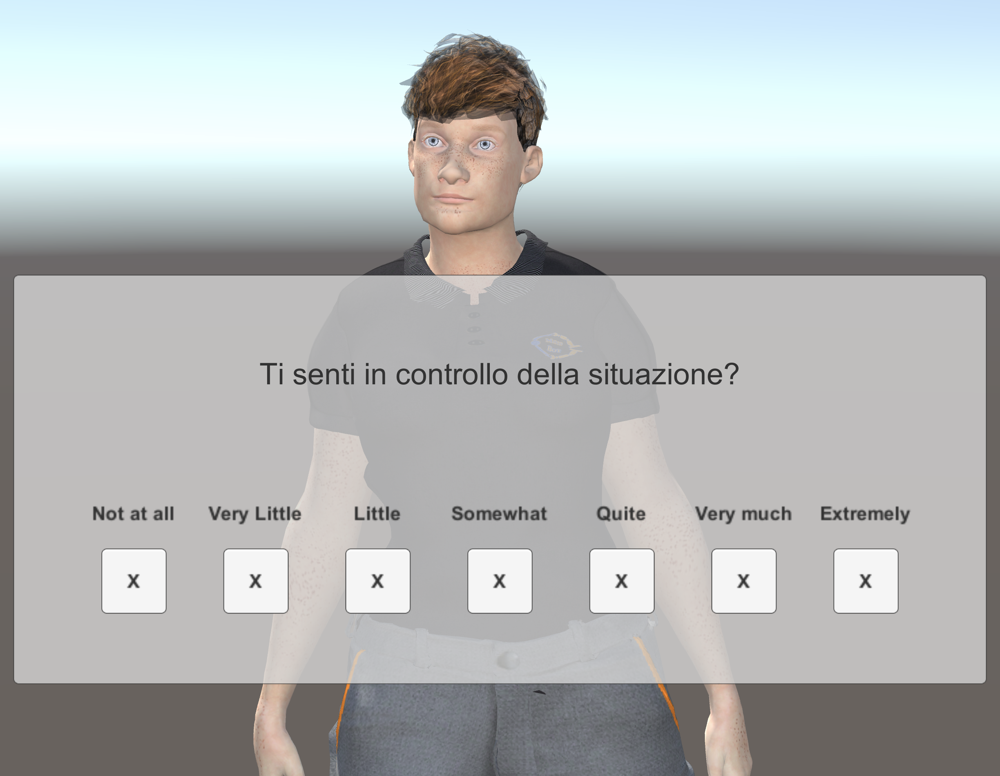
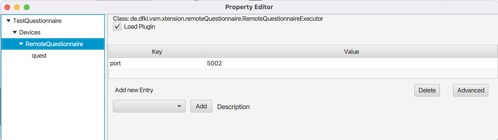

# MindBot ESM receiver

This VSM extension is part of the [MindBot project](https://www.mindbot.eu).

During the interaction with the workers, the avatar will ask to answer a few questions from the ESM (Experience Sampling Method) questionnaire.
This plugin is used to receive the answers of the worker and store them in a local Database, which will be later integrated in the overall centralized database of ESM collected during the whole study period.

In general, this plugin offers a mechanism to ask Likert-like questions and receive answers.



A client is implemented as Unity package.




## Configuration

Instantiate an agent for the plugin `RemoteQuestionnaire` and set the `port` parameter (default 5002). This is the port where the websocket server with listen for incoming connections.



## Usage

You can dynamically set the labels you like through the `SetLabels` action. Labels must be separated by a semi-column. E.g.:

```
scene em InitESMlabels
quest: [SetLabels labels='assolutamente\nno;pochissimo;poco;abbastanza;molto;moltissimo;al\nmassimo'].
```

 
Questions can be triggered through the `Question` scene action:

```
scene @@ ESM1
quest: [Question text='Sei ben concentrato?'].

scene @@ ESM2
quest: [Question text='Ti senti in controllo della situazione?'].
```


## Communication protocol

### Question

The VSM plugin sends requests to answer to a specific question as JSON message to the client, with the format:

```JSON
{
  "action_id": 123,
  "command": "Question",
  "parameters": "text=Do you like me?"
}
```

Once the client answers the question, it sends back a JSON message like:

```JSON
{
  "action_id": 123,
  "question_text": "Do you like me?",
  "answer": 2
}
```

Where
* the `action_id` is the same passed with the Question request;
* the `question_text` is supposed to be the same text displayed to the user;
* and the `answer` an integer from, e.g., 0 to 6 (for 7-level Liker scales) indicating the chosen answer.

### SetLabels

For setting labels, the message format is:

```JSON
{
  "action_id": 123456,
  "command": "SetLabels",
  "parameters": "labels=not at all;somewhat not;a little; neutral;a bit;somewhat yes;a lot"
}
```

The client sets the labels and answer with a simple message with no additional information:

```JSON
{
  "action_id": 123456,
}
```

Where the `action_id` is the same passed with the SetLabels request.

## Save format

The answers will be logged in CSV files (_TAB separated_) with the following header:

* `timestamp` (int) indicates the moment when the user gave the answer. It is expressed as Unix-time, i.e., the number of milliseconds elapsed from 01.01.1970;
* `datetime` (string) a more user-friendly formatted version of the timestamp, in yymmdd - hhmmss;
* `question_text` (string) the text of the question;
* `answer` (int) the answer of the user, in a scale from 0 to 6.

Example:
```
timestamp	datetime	question_text	answer
1667860136732	20221107-Mon-232856	Sei ben concentrato?	2
1667860147419	20221107-Mon-232907	Ti senti in controllo della situazione?	4
```

## TODO

* The command to set the labels is still limited to keep the default number of items (7). A more flexible version should be able to dynamically instantiate labels and buttons and layout them.


