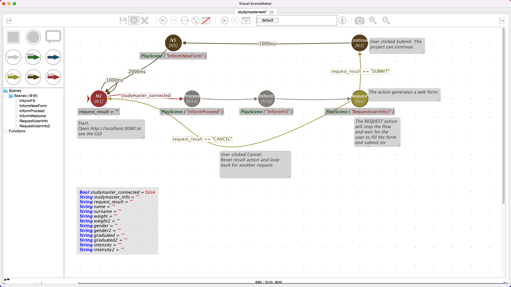

# Studymaster as a web interface 

The goal of this plugin is to provide a system to watch the status and interact with SceneMaker projects through a web interface.

The main features are:

* Present web forms (which can optionally block the scene flow execution) to allow users inputting data;
* (IN PROGRESS) Visualize the value of global variables.

This plugin uses an embedded Javalin web server to serve the web pages, and 
a web application built with React to show the information.
The communication between the web GUI and the VSM plugin is done via Websockets.

## How to use it

* Open the project preferences
* Create an instance of plugin `webstudymaster`
* Add an agent, call it for example `web`.
  * Set the parameter `port` (e.g., 8080)
* Run the project
* Open a browser at `localhost:8080`
* To show a request form, in the VSM project execute an action like this:
    * `web: [REQUEST var='name;surname;weight;gender;graduated' values='EnterName;EnterSurname;in kg;m,f,d;yes' type='text;text;text;radio;checkbox']`
      * `var` is the semi-column separated list of variables to set. Each variable should be defined in the project.
      * `type` is the semi-column separated list of types for each variable. The number of entries must equal the number of variables. Each type can be one among `text`, `radio`, or `checkbox`.
        * text: This will be one input field which will have as a placeholder the text you type in values.
        * radio: This will be one or multiple radio button, where only one can be selected for one variable. Write the label for the button in values.
        * checkbox: This will be one checkbox, which can be checked or unchecked. Write the label for the checkbox in values.
      * `values` is the semi-column separated list of initial text value, or the list of available values for checkboxes and radio buttons.
* When the action is executed, the web page will update with a request form.
  * User can click `submit` or `cancel`.
* The resulting user action will be stored in a variable `request_result`.
  * Value will be either `SUBMIT` or `CANCEL`.

Here are screenshots from an [Example Project](ExampleProject).




## How to build the App (react-studymaster in resources)

The web app is based on React and was initialized with [Create React App](https://github.com/facebook/create-react-app).

The JavaScript library React is being used here, you can find more information at <https://reactjs.org/>.

To develop the web app you require [NodeJS](https://nodejs.org/). Tested with version 15.14 
(On MacOS, can be installed with `brew install node@15.14.0`).
You also need react-scripts top buil the app:

    brew install node@15.14.0  # or download from the website
    npm install react-scripts

To build the App you need to:

* `cd` into folder `main\resources\react-studymaster`
* build a new React App to get the "node_modules" folder by typing into a console: `npx create-react-app my-app`.
  * This is of course needed only once, or to reset the whole application.
  * A folder `node_modules` is created, containing several megabytes of NodeJS packages, but it is ignored by gradle and excluded from the resources.
* Build (or update the app after changing JS/HTML code) with the command `npm run build`
  * This should be executed every time you update the JS or the HTML code of the web app.

After building, the folder main\resources\react-studymaster\build will be created or updated.

If you want to develop and update the web app without the need to re-build VSM at every change, you can:

* `cd` into folder `main\resources\react-studymaster`
* run `npm start`
* Run the VisualSceneMaker jar
* In your project use the port 8080 instead of 80
* The App will now run on localhost:3000 instead of localhost

(This skips the Javalin webserver)


## Communication Protocol

This section describes the websocket communication protocol between the web app and VSM.

### Client messages:

```VSMMessage#VAR#<var>#<value>```  
set variable <var> to value <value>

The variable request_result will automatically be filled when pressing Submit or Cancel.
Result will be "SUBMITTED" when submit is being clicked or "CANCELLED" when cancel is being clicked.


```VSMMessage#Go```  
send 'Go' message. This is usually used to hold back a scene flow that has started,
for example to hide scenemaker from study participants.

### Server messages:

```VSMMessage#REQUEST#<timestamp>#<var>#<values>#<type>```  

Request values the user can choose from or can write his answer.
Var, values and type are semicolon separated, so that multiple variables can be placed in one request. 
Every variable has to have one or multiple values, which are then comma separated inside one variable, and also one type.

Example:

`VSMMessage#REQUEST#1615553956654#name;surname;weight;gender;graduated#EnterName;EnterSurname;in kg;m,f,d;yes#text;text;text;radio;checkbox`
